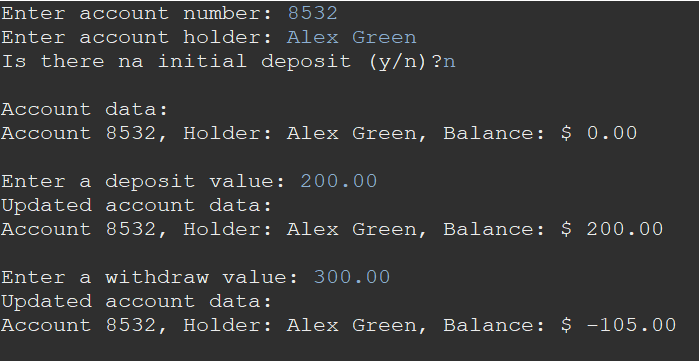

# Programa de Gerenciamento de Conta Bancária 🏦💸


Este programa em Java simula um sistema de gerenciamento de contas bancárias, permitindo aos usuários criar uma conta, fazer depósitos e sacar fundos. O programa aplica regras específicas para garantir um gerenciamento preciso das contas.

## Como Usar

1. **Clonar o Repositório:** Clone este repositório para sua máquina local usando o seguinte comando:

   ```
   bashCopy code
   git clone https://github.com/JoaoSBarbosa/bank-account-management.git
   ```

2. **Compilar os Arquivos Java:** Navegue até o diretório do projeto e compile os arquivos Java:

   ```
   bashCopy codecd bank-account-management
   javac -d out src/application/Main.java src/entities/Account.java
   ```

3. **Executar o Programa:** Execute a classe Main compilada:

   ```
   bashCopy code
   java -cp out application.Main
   ```

4. **Seguir as Instruções:** O programa irá guiá-lo pelo processo de criação de uma conta, realização de depósitos e saques. Siga as instruções para inserir as informações necessárias.

## Recursos do Programa

- Os usuários podem criar uma conta bancária fornecendo um número de conta, nome do titular da conta e um depósito inicial opcional.
- O número da conta não pode ser alterado após a criação da conta, mas o nome do titular da conta pode ser atualizado.
- O saldo da conta só pode ser aumentado por meio de depósitos e diminuído por meio de saques. Uma taxa de $5,00 é cobrada para cada saque.
- A conta pode ter um saldo negativo se os fundos forem insuficientes para cobrir um saque e/ou a taxa de saque.

## Exemplo de Uso

```
Informe o número da conta: 8532
Informe o titular da conta: Alex Green
Haverá um depósito inicial (s/n)? s
Informe o valor do depósito inicial: 500.00

Dados da conta:
Conta 8532, Titular: Alex Green, Saldo: R$ 500.00

Informe o valor de depósito: 200.00

Dados da conta atualizados:
Conta 8532, Titular: Alex Green, Saldo: R$ 700.00

Informe o valor de saque: 300.00

Dados da conta atualizados:
Conta 8532, Titular: Alex Green, Saldo: R$ 395.00
```




## Contribuições

Se você deseja contribuir para este projeto, sinta-se à vontade para fazer um fork do repositório e enviar um pull request. Suas contribuições são muito apreciadas.